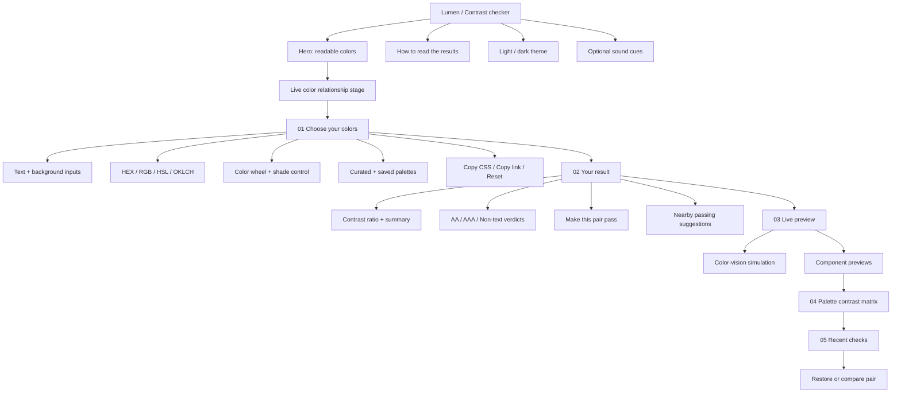

# Lumen sitemap

Lumen is currently a single-page accessibility instrument. The sitemap is organized around the user's primary task: **choose colors → understand the result → validate in context → compare or revisit**.

## SEO landing pages

These supporting pages are real crawlable HTML documents listed in `sitemap.xml`, each with a canonical URL, Open Graph metadata, Twitter metadata, and structured data:

- `wcag-guide.html` — WCAG AA, AAA, large-text, and non-text contrast guidance.
- `palette-matrix.html` — batch comparison workflow for accessible color systems.
- `color-formats.html` — HEX, RGB, HSL, and OKLCH input reference.

## Navigation map

| Anchor | Section | Purpose |
|---|---|---|
| `#top` | Home / hero | Set context and show the live relationship between colors. |
| `#colors-heading` | Choose your colors | Enter, convert, fine-tune, save, and share a color pair. |
| `#preview` | Live preview | See the pair applied to realistic interface components. |
| `#matrix` | Palette contrast matrix | Compare multiple text and background colors in one view. |
| `#history` | Recent checks | Restore, compare, or clear locally stored pairs. |
| `#about` | How to read the results | Explain AA, AAA, large text, and non-text thresholds. |

## Primary user flow

1. **Land on the hero** and understand that Lumen checks readability, not just color aesthetics.
2. **Choose or enter colors** using presets, native swatches, or a supported color format.
3. **Read the result** through the ratio, plain-language summary, and labeled verdict cards.
4. **Improve the pair** with a suggested adjustment or the “Make this pair pass” control.
5. **Validate in context** in the live preview and optional color-vision simulations.
6. **Scale the check** with the palette matrix, then revisit useful pairs from recent history.

## Persistent utilities

- Light/dark theme toggle
- Optional sound cues
- Keyboard shortcuts: `S` swap, `R` reset, `C` copy
- Shareable URL query parameters: `?fg=...&bg=...`
- Local-only storage for saved palettes and recent checks
